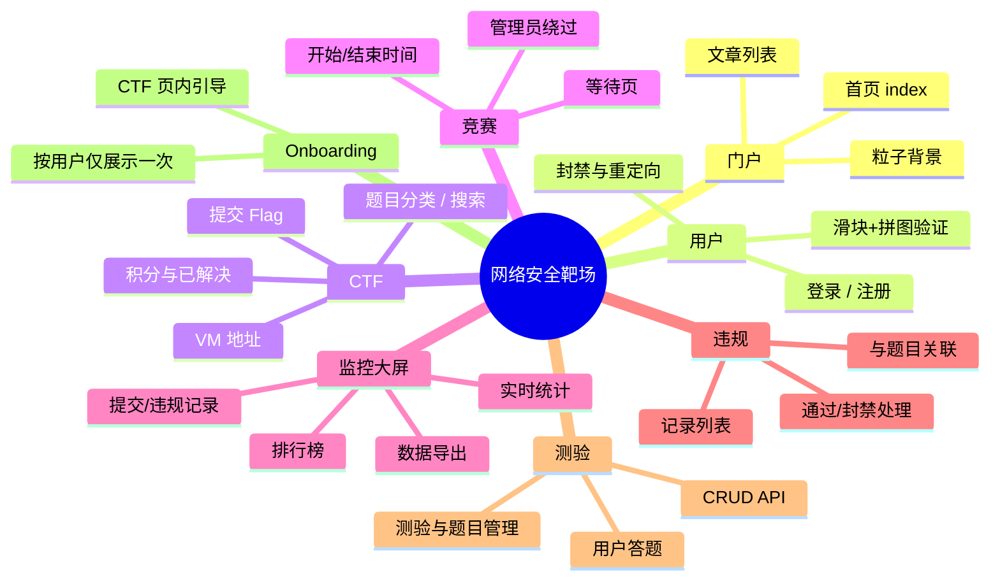
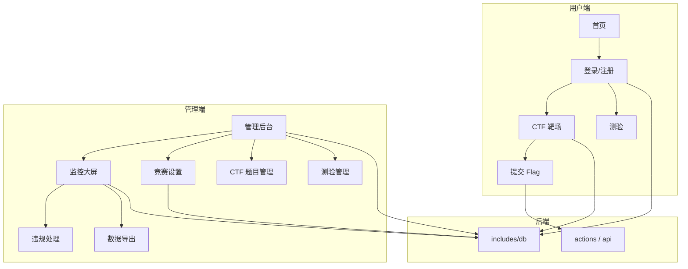

# 网络安全靶场 · 实战演练平台

> 基于 PHP + MySQL 的 CTF 夺旗赛与监控大屏系统，支持竞赛时间控制、违规处理、测验与新手引导，适用于校内实训与企业培训。

[](https://www.php.net/)
[](https://www.mysql.com/)
[](LICENSE)

---

## 文档导航

| 章节 | 说明 |
|------|------|
| [功能概览](#一功能概览) | 模块与能力一览 |
| [功能思维导图](#二功能思维导图) | 功能结构可视化 |
| [系统架构](#三系统架构) | 用户端 / 管理端 / 后端关系 |
| [技术栈](#四技术栈) | 后端 / 数据库 / 前端 / 运行环境 |
| [环境与依赖](#五环境与依赖) | PHP / MySQL 版本与扩展 |
| [安装与运行](#六安装与运行) | 克隆、建库、配置、启动 |
| [配置说明](#七配置说明) | 关键配置文件与用途 |
| [目录结构](#八目录结构) | 项目骨架与入口文件 |
| [路由与权限](#九路由与权限) | 页面路径与访问权限 |
| [API 参考](#十api-参考) | 接口路径与用途 |
| [数据表](#十一数据表) | 主要表及说明 |
| [开发说明](#十二开发说明) | 鉴权、配置、安全注意 |
| [许可证与贡献](#十三许可证与贡献) | MIT、Issue/PR、安全反馈 |

---

## 一、功能概览

| 模块 | 能力简述 |
|------|----------|
| **门户** | 首页、粒子背景、功能入口、文章列表、响应式布局 |
| **用户** | 注册 / 登录、滑块 + 拼图安全验证、封禁与封禁页重定向 |
| **CTF** | 题目分类与搜索、提交 Flag、积分与已解决状态、虚拟机地址管理 |
| **竞赛** | 开始 / 结束时间配置、未开始跳转等待页、管理员可绕过 |
| **监控大屏** | 实时统计、提交 / 违规记录、排行榜、数据导出（管理员） |
| **违规** | 违规记录列表、通过 / 封禁处理、与题目关联展示 |
| **测验** | 测验与题目管理（admin）、用户答题页、基础 CRUD API |
| **Onboarding** | CTF 页内新手引导，按用户仅展示一次 |

---

## 二、功能思维导图



---

## 三、系统架构



---

## 四、技术栈

| 层级 | 技术选型 |
|------|----------|
| **后端** | PHP 7.4+ · Session · MySQLi |
| **数据库** | MySQL 5.7+ / MariaDB · utf8mb4 |
| **前端** | 原生 HTML/CSS/JS · [Particles.js](https://github.com/VincentGarreau/particles.js) · [globe.gl](https://github.com/vasturiano/globe.gl) |
| **图标** | [Font Awesome](https://fontawesome.com/) 6.x |
| **运行** | Apache / Nginx / PHP 内置服务器 |

---

## 五、环境与依赖

- **PHP** ≥ 7.4（推荐 8.0+），扩展：`mysqli`、`json`、`session`，可选 `gd`（拼图验证）
- **MySQL** ≥ 5.7 或 MariaDB 10.2+
- Web 服务器将站点根目录指向项目根目录，支持解析 `.php`

---

## 六、安装与运行

### 6.1 克隆仓库

```bash
git clone https://github.com/你的用户名/你的仓库名.git
cd 你的仓库名
```

### 6.2 创建数据库

```sql
CREATE DATABASE your_db_name CHARACTER SET utf8mb4 COLLATE utf8mb4_unicode_ci;
```

### 6.3 配置数据库连接

编辑 `includes/db.php`，修改为本地环境（**勿将真实密码提交到仓库**）：

```php
$host     = 'localhost';
$db_user  = 'your_username';
$db_pass  = 'your_password';
$db_name  = 'your_db_name';
```

首次访问任意页面时，`includes/db.php` 会自动建表并执行迁移；若存在“首次创建管理员”逻辑，请查阅代码并修改默认账号与密码。

### 6.4 启动服务

**本地开发（PHP 内置服务器）：**

```bash
php -S localhost:8080 -t .
# 浏览器访问 http://localhost:8080
```

**生产环境：** 将 Apache/Nginx 文档根指向项目根目录，默认首页为 `index.php`；Apache 可配合项目内 `.htaccess` 使用。

### 6.5 首次使用

1. 打开首页，完成注册或使用已有管理员账号登录。
2. 管理员可访问：管理后台、监控大屏、竞赛设置、CTF 题目管理、测验管理。
3. 普通用户可进入 CTF 答题、测验；比赛未开始时会被重定向到 `waiting.php`。

---

## 七、配置说明

| 文件或路径 | 说明 |
|------------|------|
| `includes/db.php` | 数据库连接与自动建表/迁移，**务必本地化并勿提交敏感信息** |
| `config/auth_background.json` | 登录/注册页背景类型（颜色/图片） |
| `auth_background_config.php` | 后台修改上述配置的页面 |
| `competition_settings.php` | 竞赛开始/结束时间（管理员） |
| `.htaccess` | Apache 重写与安全规则（按需启用） |

---

## 八、目录结构

```
├── assets/
│   ├── css/              # 样式：style, ctf, monitor, onboarding, responsive 等
│   ├── js/               # 脚本：particles-config, globe, ctf, monitor, onboarding 等
│   └── images/           # 图片资源
├── includes/
│   ├── db.php            # 数据库连接与自动建表/迁移
│   ├── auth_check.php    # 登录与权限校验
│   ├── ban_redirect.php  # 封禁重定向（非需登录页）
│   ├── header.php / footer.php
│   └── PermissionManager.php
├── actions/              # 表单与业务动作：登录、注册、CTF 提交、测验等
├── api/                  # 接口：排行榜、监控、违规、导出等
├── admin/                # 管理端子模块：anti_cheat_logs, export_logs 等
├── config/               # 配置文件
├── uploads/              # 用户上传与 CTF 题目附件
├── index.php             # 首页
├── login.php / register.php
├── ctf.php               # CTF 挑战
├── monitor.php           # 监控大屏（管理员）
├── competition_settings.php
├── waiting.php           # 比赛未开始等待页
├── banned.php            # 封禁提示
├── quiz.php / quiz_admin.php
└── README.md
```

---

## 九、路由与权限

| 路径 | 说明 | 权限 |
|------|------|------|
| `index.php` | 门户 | 公开 |
| `login.php` / `register.php` | 登录 / 注册 | 公开 |
| `ctf.php` | CTF 挑战、提交 Flag、VM 地址 | 需登录，受竞赛时间限制 |
| `waiting.php` | 比赛未开始 | 需登录 |
| `monitor.php` | 监控大屏、排行榜、违规、导出 | 管理员 |
| `competition_settings.php` | 竞赛时间 | 管理员 |
| `quiz_admin.php` | 测验/题目 CRUD | 管理员 |
| `quiz.php` | 用户答题 | 需登录（视业务） |
| `banned.php` | 封禁提示 | 由逻辑跳转 |

权限与重定向逻辑见 `includes/auth_check.php`、`includes/ban_redirect.php` 及各页面内判断。

---

## 十、API 参考

以下为常用接口，请求方式与参数以源码为准；所有接口需在项目内做登录态与角色鉴权。

| 用途 | 路径 |
|------|------|
| 排行榜 | `api/get_leaderboard.php` |
| 监控统计 | `api/get_monitor_stats.php` |
| 监控记录 | `api/get_monitor_records.php` |
| 违规记录 | `api/get_violation_records.php` |
| 违规处理 | `api/process_violation.php` |
| 数据导出 | `api/export_data.php` |
| 测验 CRUD | `actions/quiz_action.php` 等 |

---

## 十一、数据表

表结构由 `includes/db.php` 在首次访问时自动创建或迁移。主要表：

| 表名 | 说明 |
|------|------|
| `users` | 用户、角色、积分、VM、onboarding 等 |
| `articles` | 首页文章 |
| `ctf_challenges` | CTF 题目 |
| `ctf_solves` | 用户解题记录 |
| `flag_submissions` | Flag 提交记录 |
| `submission_bans` | 提交违规封禁 |
| `violation_records` | 违规记录（含题目关联） |
| `monitor_records` | 监控提交记录 |
| `student_progress` | 考生进度统计 |
| `user_vms` | 用户虚拟机地址 |
| `competition_settings` | 竞赛时间配置 |
| `quiz_exams` / `quiz_questions` / `quiz_options` / `quiz_attempts` / `quiz_answers` | 测验相关 |

字段与后续迁移以 `includes/db.php` 为准。

---

## 十二、开发说明

- **鉴权入口**：`includes/auth_check.php`（需登录页）、`includes/ban_redirect.php`（封禁检查）。
- **权限控制**：`includes/PermissionManager.php`，各管理页内 `is_admin` 或角色判断。
- **配置位置**：数据库与全局配置在 `includes/db.php`、`includes/config.php`；登录背景在 `config/auth_background.json`。
- **日志**：`includes/debug_log.php` 等，日志目录 `logs/`（如有）。
- **安全**：生产环境务必修改默认管理员密码；勿将 `includes/db.php` 中真实密码提交到公开仓库。

---

## 十三、许可证与贡献

- **许可证**：[MIT License](LICENSE)（以仓库内 LICENSE 文件为准）。
- **贡献**：欢迎提交 Issue 与 Pull Request；提交前请在本地完成基本功能与权限测试。
- **安全**：安全问题请私密联系维护者，勿在公开 Issue 中暴露敏感信息。
